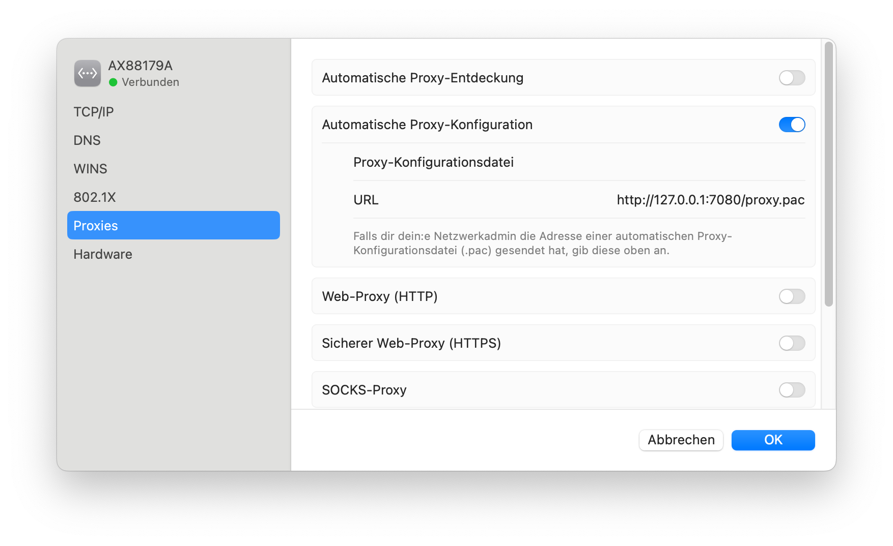

<style>
  :root {
    --color-background: #1b4085;
    --color-foreground: #ddd;
    --color-highlight: #99b7d4;
    --color-dimmed: #888;
  }

  span.muted {
    color:rgb(111, 109, 109);
    font-size: 0.825rem;
  }
</style>


# Symfony CLI for Shopware development


---
<!-- backgroundColor: white -->
<!-- color: #71797E -->

# 🧠 Why?

- ⚡️ light-weight on
  - diskspace
  - performance penalty
  - filesystem performance
- ✅ official symfony way
  - Symfony Profiler integration
  - Platform.sh integration
- 🖥️ platform agnostic

---

# 🐸 What?

- single binary built with golang
- natively installed binaries for php and extensions
  (easily done with brew 😉)
- global proxy service for local ssl
- env-injecting proxy commands

---
<!-- _class: lead -->
<!-- _backgroundColor: rgb(55, 54, 54) -->
<!-- _color: rgb(227, 234, 239) -->

# ⚙️ How?

---

# 🔗 Prerequisites

- Docker (e.g. using OrbStack on Mac)

- System PHP

<span class="muted">⚡️ quick install:</span>
```shell
brew install shivammathur/php/php@8.4
brew install shivammathur/extensions/xdebug@8.4
```

---
<!-- _class: lead -->


```shell
brew install symfony-cli/tap/symfony-cli
```

```shell
symfony local:php:list
```

---
<!-- _class: lead -->

```shell
brew services symfony-cli start
```

```shell
symfony ca:install
```



---
# Sources

- https://pixabay.com/photos/rocket-launch-rocket-space-shuttle-67649/
